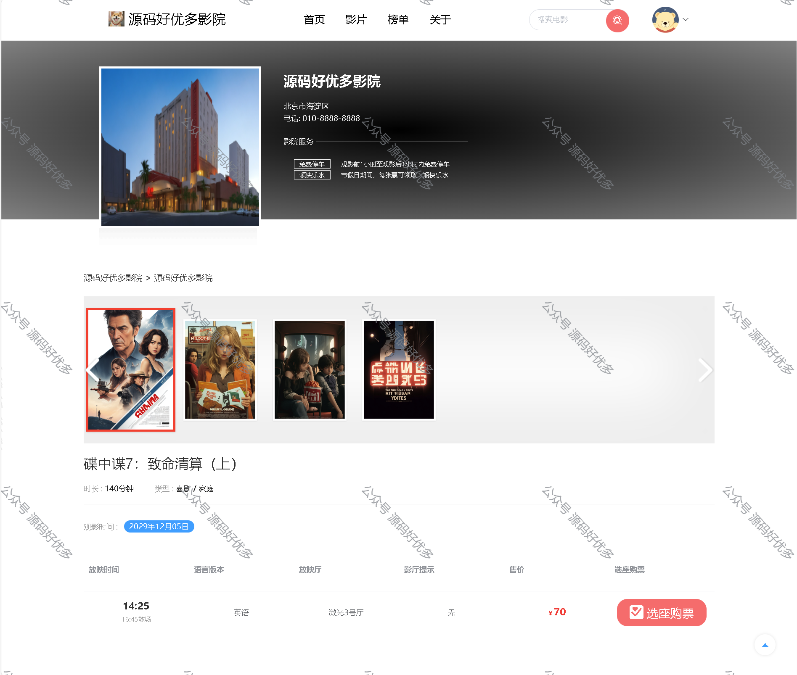
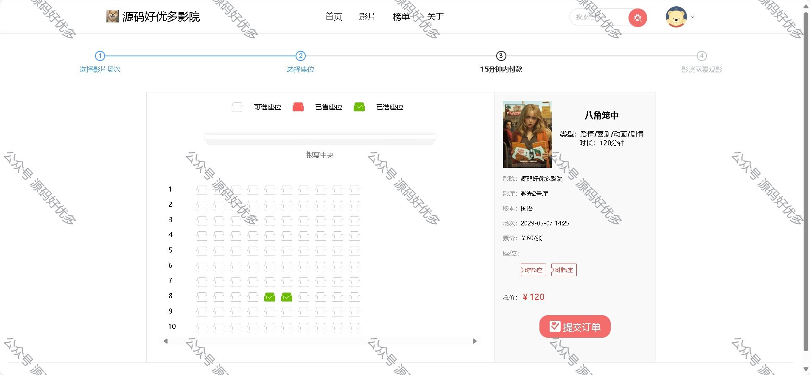
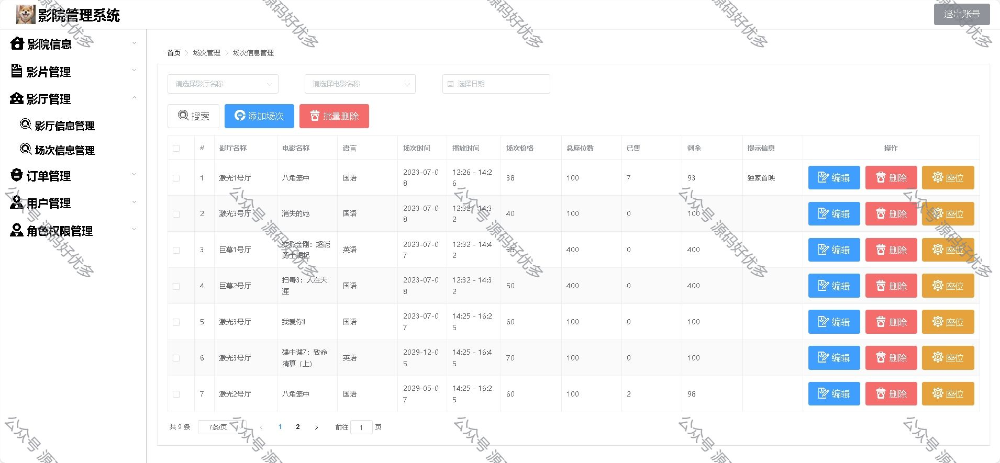
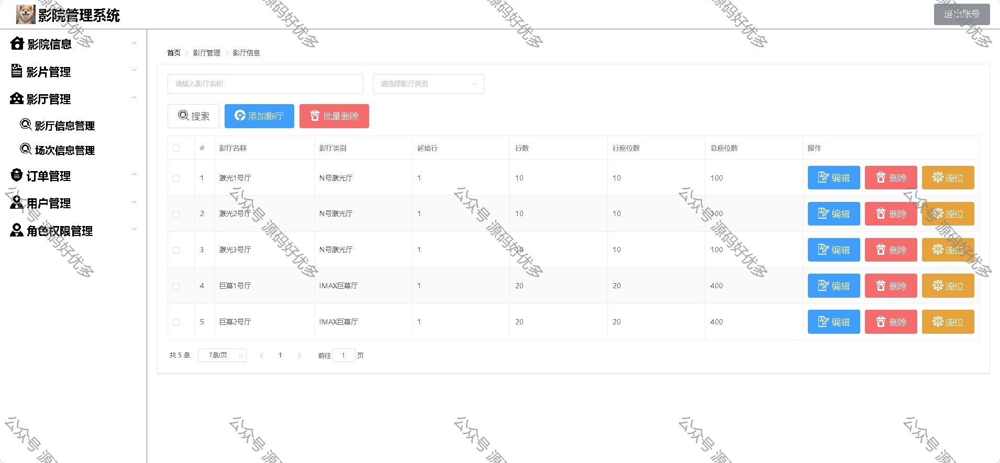

### 一、作品包含

源码+数据库+设计文档+全套环境和工具资源+部署教程

### 二、项目技术

前端技术：Html、Css、Js、Vue、Element-ui

数据库：MySQL

后端技术：Java、Spring Boot、MyBatis

### 三、运行环境

开发工具：IDEA/eclipse

数据库：MySQL8.0

数据库管理工具：Navicat10以上版本

环境配置软件： JDK1.8+Maven3.6.3

前端Nodejs：16

### 四、项目介绍

项目编号：springbootA012
电影院一直以来都是大众娱乐的主要场所之一，为观众提供了观赏电影作品的机会。然而，电影院行业在过去几十年里经历了巨大的变革，尤其是随着数字化技术的广泛应用，观众的消费习惯和期望也发生了重大改变。
传统电影院售票方式通常包括观众前往影院窗口或电话预订座位，或在放映当日到影院购票。这种方式虽然一直以来都在使用，但它存在一些显而易见的不便之处。首先，观众需要亲自前往电影院，可能需要排队等待，浪费时间和精力。其次，售票过程可能因人工操作而出现错误，例如座位分配错误或票务混乱。此外，对于电影院管理层来说，难以实时监控票务销售和观众趋势，做出及时的调整
用户端拥有登陆注册、首页浏览电影榜单、选择电影场次座位购票，进行支付、可以查看个人信息和订单信息。
管理员拥有登录功能、影院管理、影厅管理（包含影厅信息管理、场次座位管理）、影片管理、用户信息管理、角色权限管理功能

### 五、运行截图

